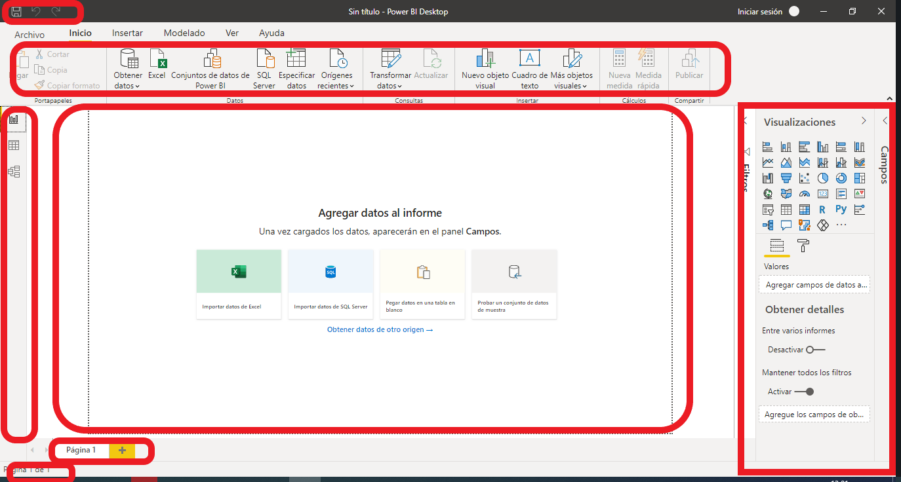
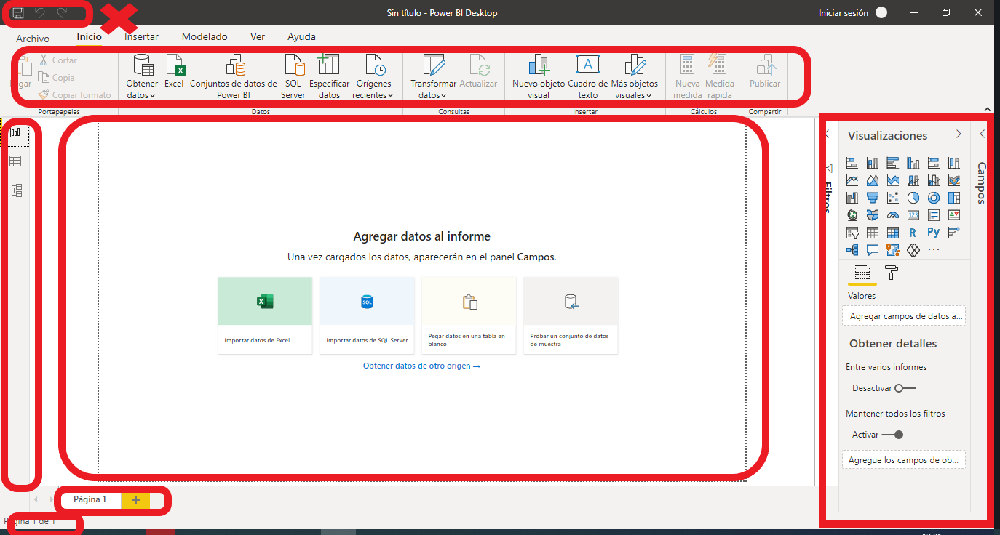
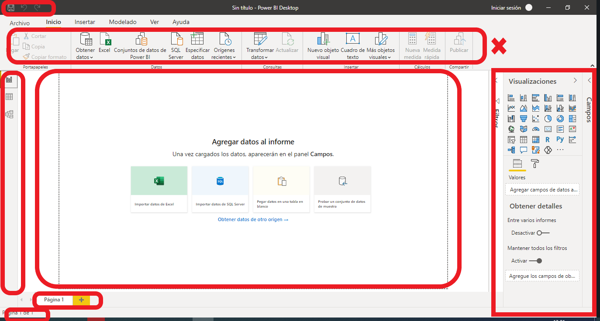
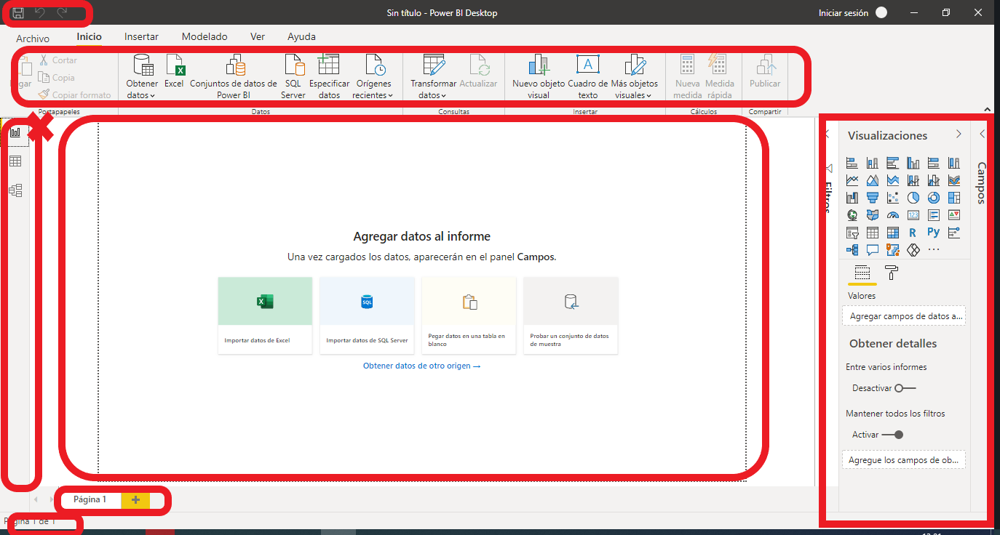
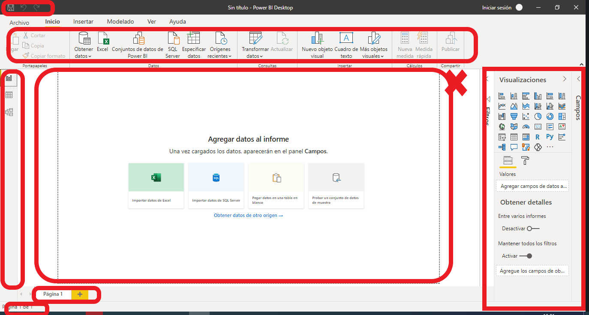
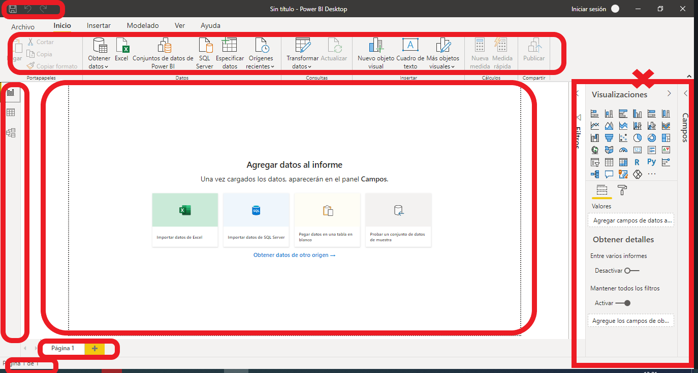
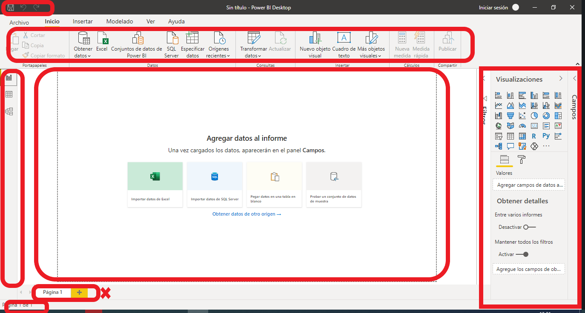
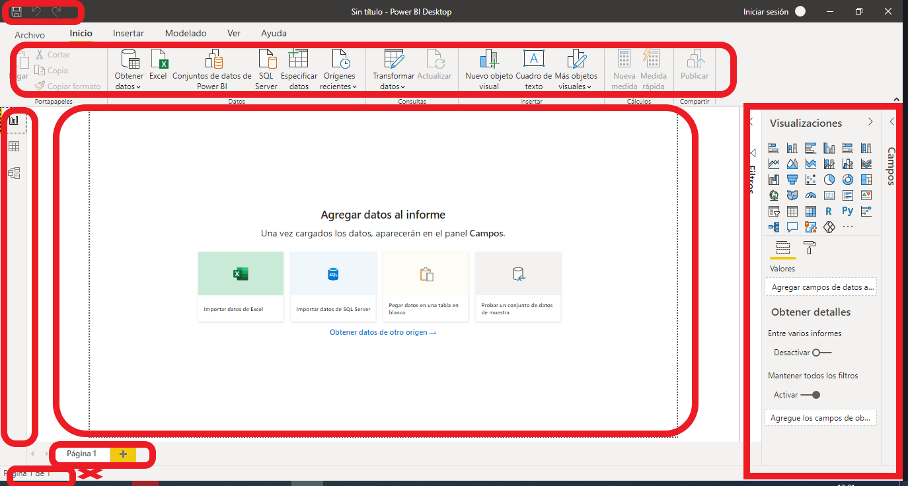
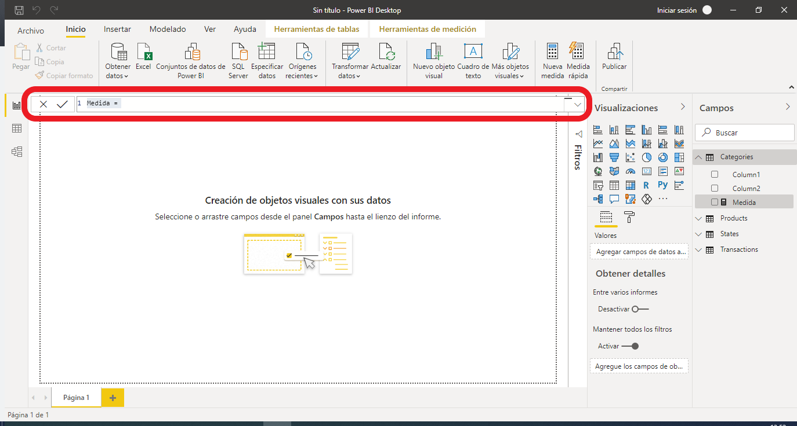

---
header-includes:
  - \usepackage[spanish]{babel}
  - \usepackage{svg}
  - \usepackage[normalem]{ulem}
  - \usepackage{attachfile}
title: |
  {width=2in}  
  ICO 187 ANÁLISIS DE DATOS
author: "Clase 12: Manipulación e integración de datos en Excel"
year: 2021
prof: "Sebastián Egaña"
# due: "Jueves 11 de Marzo"
# submit: "engin604assignments@gmail.com"
# page: "5 páginas"
# bibliography: "latex/references.bib"
# biblio-style: "acm"
link-citations: yes
citecolor: blue
urlcolor: blue
linkcolor: blue
geometry: margin=0.75in
fontsize: 10pt
output: 
  bookdown::pdf_document2:
    toc: no
    highlight: "default"
    number_sections: yes
    fig_caption: yes
    dev: cairo_pdf
    latex_engine: pdflatex
    template: "Latex/template.tex"
always_allow_html: true
nocite: '@*'
---

```{r setup, include=FALSE}
knitr::opts_chunk$set(echo = TRUE, tinytex.verbose = TRUE)

library(readxl)
library(datamodelr)
```

# Introducción a Power Bi

¿Qué es Power Bi? Veamos lo que dice Wikipedia:

\href{https://es.wikipedia.org/wiki/Power_BI}{Enlace acá}

Se hace relevante el poder discutir sobre a qué refiere el concepto de Business Intelligence o Inteligencia de negocios. Veamos esto con detención. 

# Business Intelligence, ¿qué es? (Deckler, 2019) 

Nos hemos dedicado en el transcurso del semestre a hablar de datos, visualizaciones, funciones, programación, etc. Es bueno que ahora hablemos de algunos conceptos relacionado con el tema, como también el vocabulario relacionado. 

+ Business Intelligence

Corresponde al procedimiento orientado a la toma de decisiones en base a datos. Recordar acá, que deben realizarse procedimientos para esto, de los cuales hablamos en clases: reunir y depurar la data, generar nuevas variables, etc. 

Se orienta hacia la búsqueda de eficiencia, eficacia y rentabilidad. 

Para esto, algunos conceptos relevantes son:

+ Dominio

Corresponde al contexto en dónde se espera aplicar la inteligencia de negocios. Por ejemplo: Ventas, Marketing, Producción, Investigación y Desarrollo, etc. Dicho concepto es relevante, debido a que representa en el entorno en el cual se aplica el BI, orientado siempre a la toma de decisiones. 

Tener claro el dominio nos ayuda sobre cuáles son las posibles preguntas que deben ser respondidas, como también sobre qué decisiones deben ser tomadas. Esto también determina los datos que son relevantes para el trabajo, orientada a responder las preguntas planteadas. 

+ Data

Después del dominio, se debe definir la data a utilizar. La data puede ser externa o interna, como también estructurada, no estructurada o semi estructurada. Para lo visto sobre Power Pivot, corresponde al proceso de tener las distintas tablas en Excel. 

+ Modelar

Refiere a la forma en que se organizarán los datos para realizar el análisis y las visualizaciones. Se construyen a través de la transformación y limpieza de la data. En el contexto de Power Pivot, corresponde al proceso de ingresar las tablas al modelo de datos. 

+ Organizar

Corresponde a la necesidad de tener un ordenamiento para la relación entre múltiples tablas de datos. Esto en el contexto de Power Pivot, refiere al proceso de establecer las relaciones entre los set de datos; esto mismo puede realizarse en Power BI. 

+ Transformar y limpiar

Se refiere a las posibles modificaciones a los datos. Se debe entender acá de que esto en un primero momento puede realizarse de manera previa a ingresar los datos a Power Pivot o Power BI, debido a una posible complejidad en la manipulación; pero debería apuntarse a realizar esto en la misma plataforma. 

+ Definir y categorizar

Se debe definir el tipo de data relacionada con cada tablas o set de datos, como también los formatos de cada variable. Recordemos que pueden ser textos, números decimales, número enteros, porcentajes, fechas, tiempo, fecha y tiempo, verdadero y falso, binarias, etc. Esto es importante para el análisis posterior, dado que la naturaleza de las variables determina los posibles análisis a realizar. 

Acá una pregunta, ¿el RUT corresponde a una data numérica?

+ Análisis

Se deben definir las preguntas a ser contestadas, esto a modo de orientar dicho análisis. Puede tomar varias formas, como por ejemplo el cálculo cifras agregadas como lo son sumas, promedios o conteos. En otros casos puede realizarse en función de Indicadores relevantes de gestión o KPIs, los cuáles son monitoreados por las organizaciones. 

Por otra parte, dentro del análisis también se considera la posible modelación de los datos: regresiones lineales, modelos de árboles de decisión, etc. 

+ Visualización

Es la orientación para contar una historia relacionada con los datos. Necesariamente las visualizaciones descansan en la capacidad de poder generar los datos agregados del punto anterior. 

# Power BI (Deckler, 2019)

Dentro de la dinámica de Power BI, se puede mencionar los siguientes procesos:

+ Obtener data

Existe múltiples opciones de conexión de datos, veamos esto en la aplicación. 

+ Crear modelo

Orientar los datos hacia la forma deseada; para esto existen herramientas en Power BI que nos ayudan a esto. 

+ Analizar los datos

Para el análisis y creación de nuevas variables, puede existir el caso de que se necesiten hacer cosas más allá de lo predefinido en Power BI; para esto el lenguaje de programación a utilizar corresponde a DAX. Veremos algo de esto más adelante:

<div align="center">
<button type="button" onclick="myFunction1()">Esconder meme</button>
<button type="button" onclick="myFunction2()">Ver meme</button>


<script>
function myFunction1() {
  document.getElementById("meme_02").style.visibility = "hidden";
  
}
function myFunction2() {
  document.getElementById("meme_02").style.visibility="visible";
  
}
</script>
</div>

+ Crear y publicar reporte

Existe visualizaciones predeterminadas en Power BI, pudiéndose agregar más. Por otra parte, la versión Pro permite la publicación de los reportes. 

# Entorno de Power BI (Deckler, 2019)

Veamos cada parte relevante de Power BI


{ height=600px }


## Power BI: Acceso rápido

{ height=600px }

## Power BI: Cinta de opciones

{ height=600px }

Posee las siguientes partes:

1. Archivo
2. Inicio
3. Insertar
4. Modelado
5. Ver
6. Ayuda

## Power BI: Barra de vista


{ height=600px }


+ Reporte

Es en dónde visualizamos nuestros reporte, ya sea a través de gráficos y tablas. 

+ Data

Corresponde a la visión de los datos en sí. Es también en donde aparecen las opciones de transformación y edición de datos. 

+ Modelo

En el contexto de Power Pivot, corresponde a la generación de relaciones entre distintos set de datos. 

## Power BI: Canvas

{ height=600px }

## Power BI: Paneles

{ height=600px }

+ Filtros

Posibilita el aplicar filtros a la página, todas las páginas o solo en el gráfico. 

+ Visualizaciones

Corresponde al tipo de visualización que puede ser generada; dependiendo de lo seleccionado esto ira cambiando. Es importante tener en claro la relcón entre campo y formato acá. 

+ Campos

Corresponde a los set datos con cada una de sus variables.

## Power BI: Páginas

{ height=600px }

## Power BI: Píe de página

{ height=600px }

## Power BI: Barra de fórmulas

{ height=600px }


Acá es dónde se deben ingresar las expresiones y fórmulas en DAX. Por lo general, dicho lenguaje posee la siguiente estructura:

Name = Formula

En dónde lo que se ubica a la izquierda corresponde al nombre del objeto a generar, ubicándose a la derecha los cálculos y fórmulas utilizados. Por lo general, las fórmulas en DAX empiezan con paréntesis; presionando TAB aparecen sugerencias de funciones. 

# Instalar Power Bi en Mac

Revisar esta página:

\href{https://talentoop.com/power-bi-para-mac/}{Enlace acá}

# Utilizar Power Bi desde la web

Ingresemos al link de Power Bi y veamos como avanzar con esto.

# Bibliografía

+ Deckler, G. (2019). Learn Power BI. Packt Publishing.

# Fechas Relevantes

\begin{center}
\begin{tabular}{|c|l|c|c|}
	\hline
	Unidad & Evaluación & Ponderación & Fecha \\
	\hline
	Unidad I & \sout{Evaluación diagnóstica} & & 25/03/2021 \\
	\hline
	& \sout{Evaluación Individual Participación} & (5\%) & 05/04/2021 \\
	\hline
	& \sout{Evaluación Grupal} & (15\%) & 27/04/2021 - 04/05/2021 \\
	\hline
	& \sout{Evaluación Individual - Sumativa I} & (30\%) & 11/05/2021 \\
	\hline
	Unidad II & Evaluación Formativa & & 13/05/2021 \\
	\hline
	& Evaluación Individual Participación & (5\%) & 27/05/2021 \\
	\hline
	& Evaluación Grupal & (10\%) & 08/06/2021 - 15/06/2021 \\
	\hline
	& Evaluación Individual - Sumativa II & (15\%) & 17/06/2021 \\
	\hline
	Unidad III & Evaluación Formativa & & 22/06/2021 \\
	\hline
	& Evaluación Individual Participación & (5\%) & 24/06/2021 \\
	\hline
	& Evaluación Individual Sesión I- Sumativa III & (15\%) & 08/07/2021 \\
	\hline
	& Evaluación Individual Sesión II- Sumativa III & (15\%) & 13/07/2021 \\
	\hline
\end{tabular}
\end{center}

